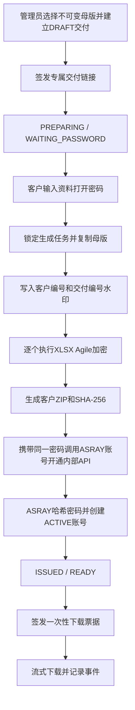

# 客户专属资料交付与ASRAY账号联动设计

## 1. 目标与边界

AstraTabi在客服确认收款并建立交付后，让持有专属交付链接的客户设置“资料打开密码”。系统从不可变母版生成客户水印副本，对全部`.xlsx`执行OOXML Agile加密，打包为客户专属ZIP并计算SHA-256；只有生成成功后才进入`ISSUED`并允许真实下载。

初版采用共通密码方式：客户在取件页设置的资料打开密码，同时作为本次购买所开通ASRAY账号的初始登录密码。AstraTabi只在该请求处理期间使用并通过已签名的内部API转交，不写入DB、日志或审计；ASRAY收到后立即进行Argon2哈希，只保存哈希值。支付资料、客户联系方式及密码原文不进入ASRAY持久层。

## 2. 交付流程

## 3. 资料密码规则

- 12～64个可见ASCII字符
- 至少包含字母和数字
- 客户输入两次，后端再次核对
- 仅在本次生成请求内存中使用，不写入DB、日志、审计、文件名或API响应
- 忘记密码时无法从系统取回原文；资料副本需要重新生成，ASRAY账号需要另行执行密码重设
- 同一次交付内所有Excel使用同一个资料密码
- 同一密码作为该次购买开通的ASRAY账号初始登录密码；页面必须明确提示共用范围

Java String无法主动擦除，因此禁止将Request、DTO或异常对象整体写入日志；生成过程不持久化密码，以缩短暴露窗口。

## 4. Excel与ZIP生成

- 使用Apache POI 5.5.1的OOXML Agile encryption
- 先在每个Sheet页脚写入`ASRAY / {customerCode} / {deliveryNo}`，再加密
- 非`.xlsx`文件原样复制；普通ZIP本身不设置兼容性较差的压缩密码
- ZIP根目录追加不含秘密的打开说明
- 全过程在私有Storage的`.staging`目录执行，最终文件原子移动
- 逐文件处理并限制条目数、展开大小和压缩比，避免大文件全部进入Heap
- 生成失败删除临时文件，Status记为`FAILED`并允许重试
- 不修改、覆盖或重新保存不可变母版

## 5. 数据模型

| 对象 | 主要字段 | 说明 |
|---|---|---|
| `portal_package_release.product_id` | 商品ID | 由受控母版文件名前缀映射 |
| `portal_delivery_package` | source/delivered key、fileName、SHA-256、size、encrypted count、generation status | 每次交付一个客户副本 |
| `portal_asray_provisioning` | eventId、status、userId、account status、legacy activation ciphertext、attempt/error | ASRAY账号开通结果；Activation密文仅用于既有待激活账号兼容 |

生成Status：`WAITING_PASSWORD`、`PROCESSING`、`READY`、`FAILED`。

## 6. 下载规则

- `POST /deliveries/{token}/download-tickets`只在`ISSUED + READY`时成功
- 签发票据不消耗次数；`GET /download-tickets/{ticket}`首次成功取得受控文件流时，在数据库锁内消耗一次次数
- `GET /download-tickets/{ticket}`验证hash、有效期、未使用状态和客户文件路径
- 票据使用后不能再次下载；Response使用`application/zip`和安全的UTF-8附件名
- 文件流开始时写入`DOWNLOAD_STARTED`；HTTP服务器无法可靠判断客户端是否完整保存文件，因此不生成虚假的“下载完成”事件
- 文件流开始后发生网络中断不返还次数
- Storage key、绝对路径、客户姓名、token hash不出现在响应或日志中

## 7. ASRAY联动

- 在客户ZIP生成成功后，以Server-to-Server方式调用`POST /internal/v1/customer-accounts`
- Header使用Client ID、UTC Timestamp、Nonce、HMAC-SHA256签名
- Payload包含eventId、customerCode、deliveryNo、productIds、entitlements、expiresAt、并发会话数及本次请求内的初始密码
- 不发送真实姓名、微信、电话或付款截图；密码原文只存在于TLS／受控内部网络上的HMAC签名请求体，不写日志和持久层
- Event ID保持幂等；调用失败不破坏已经生成的客户文件，但标记`FAILED`供管理员重试
- HMAC签名覆盖包含密码的完整请求体；Event幂等摘要排除密码字段，避免保存可用于离线猜测的密码相关摘要
- 新账号直接返回`ACTIVE`且不生成Activation URL。既有`PENDING_ACTIVATION`账号用同一Event重试时设置密码、转为`ACTIVE`并使旧Activation token失效
- 已是`ACTIVE`的同一Event重试只返回原账号，不重设密码
- ASRAY新规发行的User ID为`asr-`加8位易读随机码；AstraTabi将User ID视为不透明字符串，不按Prefix或长度判断
- 已发行的`ext-`形式继续原样保存和显示，不触发再发行或Migration

本期联动将母版Release的`product_id`原样发送，并按以下矩阵计算商品权限。ASRAY侧也按相同矩阵重新计算；未知商品或矩阵不一致时不创建账号。

| product_id | 商品权限 | 训练范围 |
|---|---|---|
| DEMO_BASIC | SIM_CORE_WORKFLOW | 基本操作 |
| DEMO_TEST | SIM_CORE_WORKFLOW、SIM_TEST_EVIDENCE | 基本操作、本人测试证迹・帐票 |
| DEMO_MANAGEMENT | SIM_CORE_WORKFLOW、SIM_MANAGEMENT_OPERATIONS | 基本操作、本人计划・帐票 |
| DEMO_FULL | 上述全部 | 外部账号用全训练范围 |

外部账号在ASRAY中始终使用`MEMBER`角色。承认、案件管理、予实管理、用户・组织・主数据管理不作为商品权益开放，避免共享训练案件中的跨客户数据访问。`SIM_CORE_WORKFLOW`付与账号由ASRAY自动、幂等地加入共用训练案件`EXT-TRAINING`。

## 8. 验收条件

- 母版SHA-256在生成前后不变
- 客户ZIP中每份XLSX无密码不能打开，正确密码可解密并看到水印
- ZIP与DB SHA-256一致，未混入临时文件或明文密码
- 生成失败不进入`ISSUED`，可安全重试
- 同一票据只能流式下载一次，次数并发控制正确
- ASRAY重复Event不产生重复账号；`ACTIVE`重试不改变密码；既有`PENDING_ACTIVATION`可用本次密码完成开通
- 审计和应用日志中不存在密码、原始Token、Activation URL或本地路径

## 15. 共通密码直接开通补足（实装完成：2026-08-16）

- 新规购买不再要求客户跳转到ASRAY Activation画面；资料密码设置成功后账号即为`ACTIVE`。
- Portal公开领取响应保存并返回ASRAY账号状态，刷新页面后仍显示User ID，不再依赖前端临时状态。
- 既有客户包已`READY`但账号仍为`PENDING_ACTIVATION`时，领取页显示补录表单；客户重新输入预定共通密码后完成开通，不重新生成账号或重复付权。
- 旧`/activate`接口、Activation table及既有未使用token继续保留；直接开通成功时将对应旧token标记为使用済，防止之后再次设置密码。
- 本变更优先减少客户密码混淆。共通密码泄露会同时影响资料和模拟系统，因此单一Session、异常IP提示、管理员暂停及客户水印继续作为共享抑止控制。

实现后验证结果见`20260816_shared_password_direct_activation_implementation_test_review.md`。本地自动测试、PostgreSQL联动及登录验证已通过；正式TLS、正式Secret、正式客户UAT与生产Go／No-Go仍未实施。

## 9. 判定边界

本设计先在本地Docker和自动化测试中验证。真实域名、TLS、对象存储、正式客户、正式验收和生产Go/No-Go仍为`未实施/未判定`。

## 10. 实装反馈（2026-08-07）

| 区分 | 结果 |
|---|---|
| DB | Flyway V7新增客户交付包、ASRAY开通状态及商品ID字段 |
| 资料生成 | 客户密码校验、逐Sheet页脚水印、XLSX Agile加密、ZIP及SHA-256生成已实现 |
| 下载 | READY校验、一次性票据、首次真实取流计次、ZIP流式响应已实现 |
| 账号联动 | HMAC签名、Event幂等、失败重试、Activation URL密文保存已实现 |
| 画面 | 客户密码设置、生成结果、账号开通提示、真实下载已接通 |
| 自动测试 | 后端资料生成/密码解密测试6件通过；前端构建通过 |
| 跨系统测试 | 本地Docker完成生成、开通、激活、单会话登录、真实下载、摘要一致、票据单次使用和次数上限验证 |

制造中发现并关闭两项偏差：共享网络缺少稳定的ASRAY服务别名，以及本地联动开关未开启。应用默认值和环境变量样例仍保持关闭，避免误在非本地环境启用。正式环境部署、TLS、正式客户UAT与Go/No-Go未实施。

## 11. 资料密码输入UX补足（2026-08-07）

- 密码与确认密码使用不同的`id`和`name`，避免浏览器或密码管理器混淆字段。
- 保持密码原文输入，不自动`trim`、删除或半角转换，防止页面显示值与Excel实际打开密码不一致。
- 提供统一的显示/隐藏控制，客户可在复制确认前核对内容。
- 粘贴时只显示字符数和非法字符提示，不回显、记录或发送密码内容。
- 即时检查12～64位、可见ASCII、英文字母、数字和两次一致；任一项不满足时禁止提交。
- 汉字、全角字符、空格和换行允许暂时出现在输入框中以便客户识别问题，但必须标红且不能提交；后端校验继续作为最终防线。

## 12. ASRAY User ID短缩化联动补足（2026-08-08）

ASRAY新规发行响应的User IDを`asr-XXXXXXXX`へ変更した。AstraTabi的保存Column为50文字，现有处理不验证Prefix或固定长度，因此无需DB Migration和生产逻辑修改。Contract Test使用新形式确认响应保持；客户Package Service的既有`ext-`Fixture继续保留，用于确认旧Account结果仍可保存和交付。

## 13. 职种别Package与ASRAY权限联动补足（2026-08-09）

客服确认收款后，管理员选择已登记的职种别Package建立交付。Package Release的`base_name`在上传时转换为既有四级`product_id`，后续资料密码设置、客户副本生成、ASRAY账号开通及下载流程不变。

| Package base_name | 销售包 | product_id | ASRAY范围 |
|---|---|---|---|
| `ASRAY_ROLE_DEVELOPER` | 开发岗位专属包 | `DEMO_TEST` | 基础操作、本人测试证迹・帐票 |
| `ASRAY_ROLE_TEST` | 测试岗位专属包 | `DEMO_TEST` | 基础操作、本人测试证迹・帐票 |
| `ASRAY_ROLE_OPERATIONS` | 运维岗位专属包 | `DEMO_MANAGEMENT` | 基础操作、本人计划・帐票 |
| `ASRAY_ROLE_PM_PL` | PM・PL岗位专属包 | `DEMO_MANAGEMENT` | 基础操作、本人计划・帐票 |

职种名称不是ASRAY内部Role。外部账号仍固定为`MEMBER`，由Entitlement控制本人范围；不授予`MANAGER`、`ADMIN`或内部Role Authority。Developer与Tester、Operations与PM・PL分别共享系统训练范围，但交付资料内容不同。

Package Release的版本唯一性按`project_code + base_name + version + release_date`判定。不同商品允许使用同一版本和发布日期，同一商品的同一版本仍禁止覆盖。正式母版文件名保持`{base_name}_v{SemVer}_{YYYYMMDD}.zip`；带`RC`标识的候选包不能直接登记为正式母版，需在正式发行工程中重新命名、生成对应SHA-256并完成验收。

本补足不增加微信支付API。购买成立的系统触发点仍为客服确认收款后由管理员建立交付。

## 14. 职种别Package实装反馈（2026-08-09）

四种职种别Package已加入受控母版清单，并按第13节固定映射为`DEMO_TEST`或`DEMO_MANAGEMENT`。Flyway V8将Release唯一约束调整为`project_code + base_name + version + release_date`，因此不同商品可在同版同日并存，同一商品仍不可覆盖。管理画面的版本选择项同时显示base name、版本与发布日期。

本地隔离环境使用四份正式命名测试母版完成上传、交付、客户密码设置、专属ZIP生成和ASRAY账号开通。四件交付均进入`ISSUED`，ASRAY侧分别取得预定Entitlement并以`MEMBER`加入`EXT-TRAINING`。开发／测试账号只显示基础与测试范围；运维／PM・PL账号追加本人计划范围，所有外部账号的承认、案件管理、予实及系统管理仍被拒绝。

制造中发现上传成功后表单复位使用失效的异步事件引用，页面显示`Cannot read properties of null`。已在提交开始时保存Form引用，成功后使用稳定引用复位，并通过实际上传重新验证。正式客户、微信支付API、生产域名、TLS及生产Go／No-Go不在本次范围内，继续为未实施・未判定。
