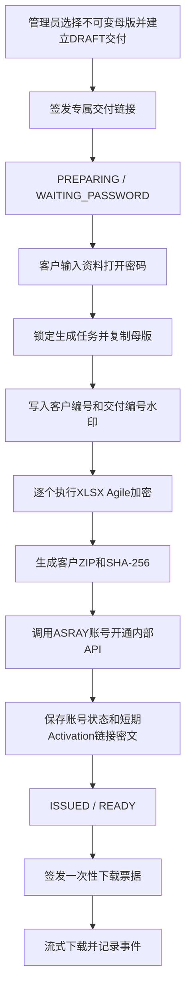

# 客户专属资料交付与ASRAY账号联动设计

## 1. 目标与边界

AstraTabi在客服确认收款并建立交付后，让持有专属交付链接的客户设置“资料打开密码”。系统从不可变母版生成客户水印副本，对全部`.xlsx`执行OOXML Agile加密，打包为客户专属ZIP并计算SHA-256；只有生成成功后才进入`ISSUED`并允许真实下载。

资料打开密码与ASRAY登录密码分离。AstraTabi不接收、保存或转发ASRAY登录密码；ASRAY不接收资料打开密码、支付资料或客户联系方式。

## 2. 交付流程

## 3. 资料密码规则

- 12～64个可见ASCII字符
- 至少包含字母和数字
- 客户输入两次，后端再次核对
- 仅在本次生成请求内存中使用，不写入DB、日志、审计、文件名或API响应
- 忘记密码时无法找回，只能废弃旧交付副本并重新生成
- 同一次交付内所有Excel使用同一个资料密码

Java String无法主动擦除，因此禁止将Request、DTO或异常对象整体写入日志；生成过程不持久化密码，以缩短暴露窗口。

## 4. Excel与ZIP生成

- 使用Apache POI 5.5.1的OOXML Agile encryption
- 先在每个Sheet页脚写入`ASRAY / {customerCode} / {deliveryNo}`，再加密
- 非`.xlsx`文件原样复制；普通ZIP本身不设置兼容性较差的压缩密码
- ZIP根目录追加不含秘密的打开说明
- 全过程在私有Storage的`.staging`目录执行，最终文件原子移动
- 逐文件处理并限制条目数、展开大小和压缩比，避免大文件全部进入Heap
- 生成失败删除临时文件，Status记为`FAILED`并允许重试
- 不修改、覆盖或重新保存不可变母版

## 5. 数据模型

| 对象 | 主要字段 | 说明 |
|---|---|---|
| `portal_package_release.product_id` | 商品ID | 由受控母版文件名前缀映射 |
| `portal_delivery_package` | source/delivered key、fileName、SHA-256、size、encrypted count、generation status | 每次交付一个客户副本 |
| `portal_asray_provisioning` | eventId、status、userId、activation ciphertext、attempt/error | ASRAY账号开通结果 |

生成Status：`WAITING_PASSWORD`、`PROCESSING`、`READY`、`FAILED`。

## 6. 下载规则

- `POST /deliveries/{token}/download-tickets`只在`ISSUED + READY`时成功
- 签发票据即消耗一次次数，沿用已确认业务规则
- `GET /download-tickets/{ticket}`验证hash、有效期、未使用状态和客户文件路径
- 票据使用后不能再次下载；Response使用`application/zip`和安全的UTF-8附件名
- 开始、完成、失败均写入下载事件；网络中断不返还次数
- Storage key、绝对路径、客户姓名、token hash不出现在响应或日志中

## 7. ASRAY联动

- 在客户ZIP生成成功后，以Server-to-Server方式调用`POST /internal/v1/customer-accounts`
- Header使用Client ID、UTC Timestamp、Nonce、HMAC-SHA256签名
- Payload只包含eventId、customerCode、deliveryNo、productIds、entitlements、expiresAt和并发会话数
- 不发送真实姓名、微信、电话、付款截图、资料密码或ASRAY登录密码
- Event ID保持幂等；调用失败不破坏已经生成的客户文件，但标记`FAILED`供管理员重试
- Activation URL使用AES-GCM和独立环境密钥短期加密保存；页面只在有效交付Token下显示

商品与训练权限映射：

| Product | Entitlement |
|---|---|
| `SIMULATION_SOURCE`、旧`ASRAY_COMPLETE` | `DEMO_FULL` |
| `DOCS_COMPLETE`、`DESIGN_EXAMPLES`、`REQUIREMENTS_COMMUNICATION`、`INCIDENT_BUG` | `DEMO_BASIC` |
| `TEST_EVIDENCE`、`ROLE_TEST` | `DEMO_TEST` |
| `PM_RELEASE_OPERATIONS`、`ROLE_OPERATIONS`、`ROLE_PM_PL` | `DEMO_MANAGEMENT` |
| `ROLE_DEVELOPER` | `DEMO_DEVELOPER` |

## 8. 验收条件

- 母版SHA-256在生成前后不变
- 客户ZIP中每份XLSX无密码不能打开，正确密码可解密并看到水印
- ZIP与DB SHA-256一致，未混入临时文件或明文密码
- 生成失败不进入`ISSUED`，可安全重试
- 同一票据只能流式下载一次，次数并发控制正确
- ASRAY重复Event不产生重复账号；联动失败可重试
- 审计和应用日志中不存在密码、原始Token、Activation URL或本地路径

## 9. 判定边界

本设计先在本地Docker和自动化测试中验证。真实域名、TLS、对象存储、正式客户、正式验收和生产Go/No-Go仍为`未实施/未判定`。
