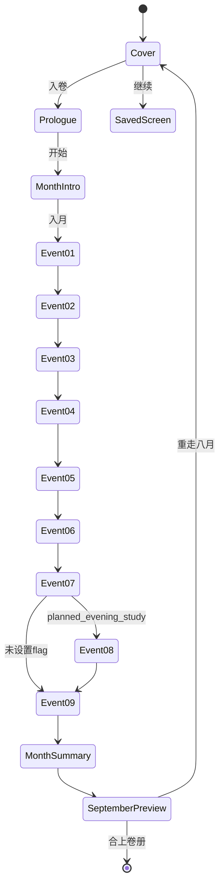

# 《云月浮生》MVP 基本设计

作成日：2026-08-17

对象：AstraTabi Portal 公开前端

状态：第一卷“极东”序章、八月及九月预告 `実装済`；第二月以后 `未実装`

## 1. 目的与范围

在云月小铺内提供一款卷式互动人生模拟器。玩家通过选择体验第二次赴日后的现金流、工作、身体与精神状态。第一版不接后台、账号、支付或实时外部数据，存档仅保存在当前浏览器。

第一版包含：

- 中日双语封面、序章、月份导入、事件、人物笺、月末账簿与九月预告。
- 2024 年 8 月 Event 00～09。
- 统一数值效果、条件、flag、完成事件和权重抽取。
- 自动存档、继续与重新开始。
- 固定作品入口、直接 URL 和首页木牌偶发入口。
- 移动端、键盘焦点与减少动态效果设置。

范围外：第二月正式内容、完整一年、后台同步、跨设备存档、登录、支付、排行榜、地图、战斗、恋爱和实时 AI。

## 2. 入口与路由

| 入口 | 路由 | 规则 |
|---|---|---|
| 直接访问 | `/#fusheng` | 不要求先进入小铺，可直接看到游戏封面 |
| 百工坊 | `/#workshop` → `/#fusheng` | 固定作品卡片，始终可发现 |
| 今日木牌 | `/#home` → `/#fusheng` | 默认 12% 的按日稳定概率 |

木牌优先级：置顶 → 招募 → 掌柜外出 → 特别日 → 新内容 → 游戏偶发 → 久未更新 → 天气 → 开业 → 周末/时段。

同一天使用日期、类别和 `selectionVersion` 生成稳定结果。刷新页面不重新随机；修改 `selectionVersion` 可以在运营时更换当天结果。

## 3. 页面迁移

每次事件选择后先显示叙事结果和可见数值变化，玩家点击“继续翻页”后才进入下一事件。

## 4. 状态设计

### 4.1 可见状态

- 债务 RMB、现金 JPY、行动点。
- 身体、精神、社交电量、自由度以文字阶段显示。
- 人物笺显示日语、技术、职场和产品能力。

行动点允许小于 0，表示主动或被动透支。除债务、工资和汇率的非负约束外，身体/精神/能力及隐藏变量限制在 0～100。

### 4.2 隐藏状态

`stress`、`recoveryDebt`、`lossOfControl`、`obsession`、`lifePoverty`、`workTrust`、`debtStress`、`observerActivity`、`boundary`。

隐藏状态参与条件与后续概率，但不在当前 UI 暴露精确值。

### 4.3 存档

- Key：`astratabi:yunyue-fusheng:v1`
- 保存时点：语言切换、开始游戏、每次事件选择、页面迁移。
- 内容：月份、页面、数值、flag、完成事件、选择履历、当前事件和选择结果。
- 限制：仅当前浏览器；清除站点数据或更换设备后不可恢复。
- 后续结构变更必须提高版本并实现迁移，禁止静默破坏旧存档。

## 5. 事件与引擎

事件内容使用 `GameEvent` 数据定义，React 页面不按月份或事件 ID 编写业务判断。

| 机能 | 入口函数 | 说明 |
|---|---|---|
| 数值变化 | `applyEffects()` | 统一应用并执行上下限规则 |
| 条件判定 | `checkCondition()` | stat、flag、completedEvent、month |
| 可用事件 | `getAvailableEvents()` | 排除已完成和条件不成立事件 |
| 权重抽取 | `pickWeightedEvent()` | 为后续随机事件池预留 |
| 主线推进 | `pickNextStoryEvent()` | 优先 order，之后使用权重池 |

因果示例：Event 03 选择“晚上再看”时写入 `planned_evening_study`，Event 08 只有持有该 flag 才出现。Event 08 的娱乐失控结果同时检查压力阈值和概率，避免与前序状态无关的纯 RNG。

## 6. 双语

所有事件标题、正文、观测者内容、选项和结果均使用 `LocalizedText`。中文模式保留日本职场原句并显示中文叙事；日文模式仅显示日文叙事，不在同屏堆叠两套全文。

语言切换保存到同一个游戏存档，切换后当前事件不重置。

## 7. 视觉与 CSS 责任

- 游戏采用现代卷册、宣纸、墨色、东京夜色、月色蓝和少量朱红。
- 游戏样式由 `YunyueFusheng.module.css` 独占，避免覆盖 Portal 现有选择器。
- Portal 的 `styles.css` 只拥有木牌入口和百工坊作品卡片样式。
- 游戏路由隐藏 Portal 导航、页脚和背景音乐控件，退出后恢复原页面行为。
- 游戏使用路由级按需加载；普通小铺访问不下载事件内容和 Framer Motion 游戏 chunk。
- `prefers-reduced-motion` 时取消位移类 hover/过渡；Framer Motion 同时读取减少动态效果设置。

## 8. 埋点预留

`trackEvent()` 当前为空实现，预留 `game_start`、`language_change`、`event_view`、`event_choice`、`month_complete`、`game_restart`、`game_exit`。在完成隐私说明和数据范围评审前，不连接外部分析服务。

## 9. 后续扩展

第二月应新增独立事件文件，先实现工资到账、固定支出、最低还款和额外收入解锁，再扩展随机工作/健康/副业池。不得在页面组件中增加大量 `month === 9` 分支。
